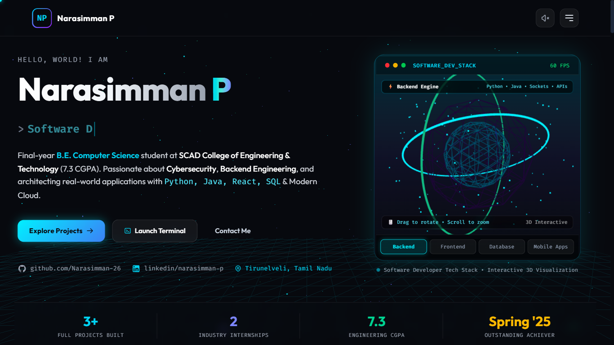

# ⚡ Narasimman P — 3D Software Developer Portfolio

A futuristic, high-performance **3D Portfolio Website** designed for **Narasimman P** (Final-year B.E. Computer Science & Engineering student at **SCAD College of Engineering and Technology**, Tirunelveli). 

Built with **Three.js (WebGL)**, **Vite**, **Tailwind CSS v4**, and **Modern Web Standards**.



---

## 🌟 Key Features

1. **Interactive 3D WebGL Hero Canvas**:
   - Real-time 3D models with interactive mouse drag-rotation, scroll-to-zoom, and click impulse reactions.
   - **4 Switchable 3D Visual Modes**:
     - `Cyber Core`: Geodesic Icosahedron core with dual orbital gimbal rings and glowing particles.
     - `Torus Knot`: Holographic iridescent mathematical knot with pulsating energy.
     - `Neural Web`: Interconnected 3D nodes representing network security and real-time sockets.
     - `Cyber Shield`: Multi-layered defensive diamond mesh symbolizing threat prevention.
   - Dynamic 60 FPS counter and interactive lighting shaders.

2. **Cosmic Background 3D Canvas**:
   - Multi-colored Starfield particles (`Cyan`, `Indigo`, `Emerald`) with mouse and scroll parallax movement.
   - Low-latency wireframe cyber terrain plane at the base.

3. **Interactive Cyber Terminal (CLI v2.6)**:
   - Functional Unix-style bash simulator right on the page.
   - Commands: `help`, `about`, `skills`, `projects`, `experience`, `certifications`, `contact`, `resume`, `sudo`, `quote`, `clear`.
   - **Matrix Rain Easter Egg**: Run `matrix` to trigger authentic falling digital rain across the screen!

4. **Detailed Projects Showcase with Architecture Modals & MCP Protocol**:
   - **SafeHer**: Women Safety Application (Hackathon Project) — React Native, Expo, Supabase, MySQL, GPS Integration, and MCP integration for contextual smart replies.
   - **ERP Attendance Management System**: College Academic Project — React.js, Firebase, PostgreSQL, serving 180+ users with MCP cross-database connectivity.
   - **SecureChat**: Real-time Encrypted Communication Application — IndexedDB, AES-256, React, Tailwind CSS, and MCP architecture.
   - Interactive 3D tilt cards with deep-dive architectural data flow diagrams.

5. **Integrated Executive Curriculum Vitae (CV) & One-Click PDF Print**:
   - Clean, human-crafted executive resume template accessible via the navbar and modals.
   - Dedicated `@media print` styling allowing instant, clean export to a professional 1-page PDF.

6. **Web Audio API Sci-Fi Synthesizer**:
   - Subtle futuristic sound feedback on clicks, commands, and mode switches (zero external audio file dependencies).
   - Audio FX toggle in navbar with `localStorage` memory.

7. **Interactive Skills Matrix**:
   - Categorized filters: `Languages`, `Web & Frameworks`, `AI & Automation`, `Cybersecurity`, `Tools & Platforms`.
   - AI & Automation stack: Claude API, Model Context Protocol (MCP), Playwright, Selenium, n8n, Prompt Engineering.
   - Animated proficiency meters and glowing tech tags.

8. **Direct Contact System**:
   - Working contact form with instant validation, celebratory confetti (`canvas-confetti`), and direct `mailto:` integration.
   - Quick one-click copy buttons for Email (`pnarasimman26@gmail.com`) and Phone (`8526824759`).
   - Direct WhatsApp message link.

---

## 🛠️ Tech Stack

- **3D Graphics & Engine:** Three.js (WebGL, BufferGeometry, Shaders)
- **Framework & Bundler:** Vite 6
- **Styling:** Tailwind CSS v4, Modern Glassmorphism, CSS Custom Properties
- **Typography:** Outfit, Space Grotesk, Fira Code
- **Micro-interactions:** Canvas-Confetti, Web Audio API, Custom Glow Cursor

---

## 🚀 Getting Started

### Prerequisites
- Node.js (v18+ recommended)
- npm

### Installation & Run Locally

```bash
# 1. Install dependencies
npm install

# 2. Run local development server
npm run dev
```

Open [http://localhost:5173](http://localhost:5173) in your browser.

### Build for Production

```bash
# Generate optimized production bundle in /dist
npm run build

# Preview production build locally
npm run preview
```

---

## 🌐 Free 1-Click Deployment Options

### Deploy to GitHub Pages
1. Push this repository to GitHub under `Narasimman-26/portfolio`.
2. In `vite.config.js`, set `base: '/portfolio/'`.
3. In GitHub repo settings, enable **GitHub Pages** from `gh-pages` branch or GitHub Actions.

### Deploy to Vercel / Netlify
- Import the repository directly in [Vercel](https://vercel.com) or [Netlify](https://netlify.com).
- Build command: `npm run build`
- Output directory: `dist`

---

## 👤 Author

**Narasimman P**
- 📍 Tirunelveli, Tamil Nadu, India
- 🎓 SCAD College of Engineering and Technology (B.E. CSE - 7.3 CGPA)
- 💼 LinkedIn: [linkedin.com/in/narasimman-p](https://linkedin.com/in/narasimman-p)
- 🐙 GitHub: [github.com/Narasimman-26](https://github.com/Narasimman-26)
- ✉️ Email: [pnarasimman26@gmail.com](mailto:pnarasimman26@gmail.com)
- 📞 Phone: +91 8526824759
